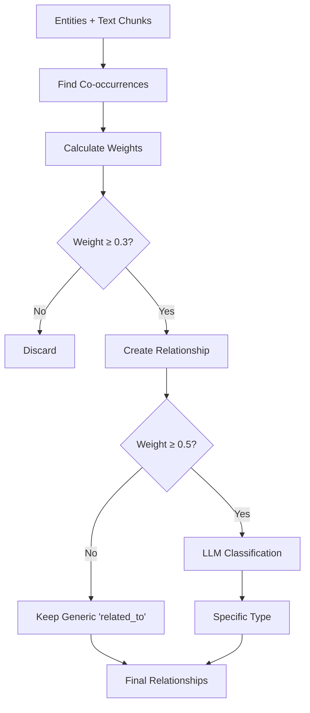
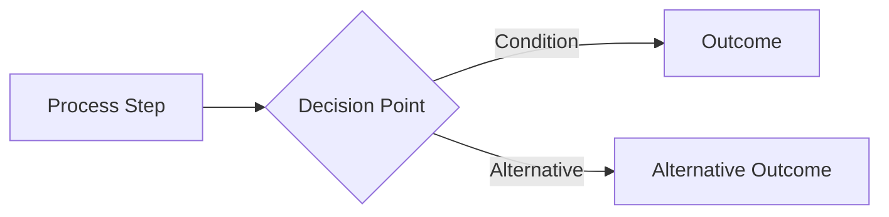

# Algorithm Documentation

## Overview
This document describes the core algorithms used in the Really Nicca Knowledge Graph Extraction Engine, including entity extraction, deduplication, and relationship classification.

---

## Table of Contents
- [Entity Extraction](#entity-extraction)
- [Embedding Generation](#embedding-generation)
- [Deduplication](#deduplication)
- [Relationship Classification](#relationship-classification)
- [Complexity Analysis](#complexity-analysis)

---

## Entity Extraction

### Hybrid Approach: spaCy + Gemini

The system uses a two-stage hybrid approach combining rule-based NER with LLM enhancement.

```mermaid
flowchart TD
    A[Input Text Chunks] --> B[spaCy NER]
    B --> C[Baseline Entities]
    C --> D{Gemini Available?}
    D -->|Yes| E[Gemini Enhancement]
    D -->|No| F[Return spaCy Only]
    E --> G[Parse JSON Response]

---

## Embedding Generation

### Gemini text-embedding-004

**Algorithm**: `generate_embeddings(texts)`

**Steps**:
1. Batch texts into groups of 10
2. For each batch:
   - Call Gemini embedding API
   - Retry on failure (3 attempts, exponential backoff)
   - Return 768-dimensional vectors
3. Handle failures gracefully (return None, not zero vectors)

**Output**: List of 768-dimensional float vectors

**Complexity**: O(n / batch_size × api_latency)

---

## Deduplication

### Multi-Signal Matching

The deduplication engine uses three signals to identify duplicate entities:

```mermaid
flowchart TD
    A[Entity Pairs] --> B{Same Type?}
    B -->|No| C[Keep Separate]
    B -->|Yes| D[String Similarity]
    D --> E{Similarity ≥ 0.85?}
    E -->|Yes| F[MERGE]
    E -->|No| G[Embedding Similarity]
    G --> H{Similarity ≥ 0.90?}
    H -->|Yes| F
    H -->|No| I[Abbreviation Check]
    I --> J{Is Abbreviation?}
    J -->|Yes| F
    J -->|No| C
```

### Algorithm: `should_merge(entity1, entity2, emb1, emb2)`

**Merge Conditions** (any one triggers merge):

1. **String Similarity** ≥ 0.85
   ```python
   normalized1 = normalize_text(entity1.name)  # lowercase, remove punctuation
   normalized2 = normalize_text(entity2.name)
   similarity = SequenceMatcher(None, normalized1, normalized2).ratio()
   ```

2. **Embedding Similarity** ≥ 0.90
   ```python
   cosine_sim = dot(emb1, emb2) / (norm(emb1) * norm(emb2))
   ```

---

## Relationship Classification

### Two-Stage Approach: Co-occurrence + LLM Typing



### Stage 1: Co-occurrence Detection

**Algorithm**: `build_cooccurrence_relationships(text_chunks, entities, min_weight=0.3)`

**Steps**:
1. Map entities to chunk indices:
   ```python
   occurrences[entity_name] = {chunk_idx1, chunk_idx2, ...}
   ```

2. For each entity pair (i, j):
   - Find shared chunks: `shared = chunks_i ∩ chunks_j`
   - Calculate weight:
     ```python
     weight = len(shared) / min(len(chunks_i), len(chunks_j))
     ```
   - If weight ≥ min_weight, create relationship

3. Extract example snippets from shared chunks (up to 3)

**Weight Formula**:
```
weight = |shared_chunks| / min(|chunks_entity1|, |chunks_entity2|)
```

This allows a rare entity (1 occurrence) to have strong relationship (weight=1.0) with a common entity if they co-occur.

**Complexity**: O(n² × c) where n = entities, c = average chunks per entity

### Stage 2: Hybrid Relationship Classification

**Algorithm**: `classify_relationships_with_llm` (Hybrid Approach)

**Goal**: Assign specific types (e.g., `founded`, `works_at`) instead of generic `related_to`.

**Flow**:
```mermaid
flowchart TD
    A[Relationship (weight ≥ 0.5)] --> B{Pattern Match?}
    B -->|Yes| C[Assign Specific Type]
    C --> D[Set Confidence 0.85]
    B -->|No| E{Call Gemini LLM}
    E -->|Success| F[Assign LLM Type]
    E -->|Fail/Unsure| G[Keep 'related_to']
```

**1. Pattern Matching (Fast Path)**
- **Input**: Relationship text examples + Entity Types
- **Logic**: Check for explicit keywords validated by entity types
- **Supported Patterns**:
  - `founded` (founded, established)
  - `ceo_of` (CEO, president of)
  - `works_at` (works at, employed by)
  - `located_in` (located in, based in)
  - `authored` (wrote, published)
  - `acquired_by` (acquired, bought)
  - ...and more

**2. LLM Classification (Fallback)**
- **Input**: Entity names, Entity Types (PERSON, ORG), Text Snippets
- **Prompt**: Includes entity types and instructions to prefer specific relationships.
- **Output**: JSON with `type` and `confidence`.

**Complexity**: 
- Pattern Matching: O(1) per relationship (instant)
- LLM Fallback: O(latency) only for unclear cases

---

## Complexity Analysis

### Overall Pipeline

```
Input Text (length L)
    ↓
Text Chunking: O(L)
    ↓
Entity Extraction: O(n × m + n × g)  [n=chunks, m=chunk_length, g=Gemini_latency]
    ↓
Embedding Generation: O(e / 10 × g)  [e=entities]
    ↓
Deduplication: O(t × (e/t)² × (s + c))  [t=types, s=string_sim, c=cosine_sim]
    ↓
Relationship Detection: O(e² × avg_chunks)
    ↓
LLM Relationship Typing: O(r × g)  [r=high-weight_relationships]
    ↓
Graph Building: O(e + r)
```

### Time Complexity Summary

| Component | Complexity | Typical Time |
|-----------|------------|--------------|
| Text Chunking | O(L) | < 0.1s |
| spaCy NER | O(n × m) | 0.5-1s |
| Gemini Entity Extraction | O(n × g) | 2-5s |
| Embedding Generation | O(e / 10 × g) | 1-3s |
| Deduplication | O(e² / t) | 0.1-0.5s |
| Co-occurrence | O(e² × c) | 0.1-0.3s |
| LLM Relationship Typing | O(r × g) | 0-2s |
| **Total** | **O(L + n×g + e²)** | **3-12s** |

### Space Complexity

| Component | Space | Notes |
|-----------|-------|-------|
| Text Chunks | O(L) | Original text + chunks |
| Entities | O(e × (d + s)) | d=768 (embedding), s=snippet_length |
| Embeddings | O(e × 768) | 768-dimensional vectors |
| Relationships | O(r × k) | k=example_snippets |
| **Total** | **O(L + e×d + r)** | Dominated by embeddings |

### Optimization Strategies

1. **Batching**: Process embeddings in batches of 10
2. **Type Grouping**: Reduce deduplication from O(e²) to O(e²/t)
3. **Weight Filtering**: Only classify high-weight relationships
4. **Caching**: Cache spaCy model and Gemini client
5. **Parallel Processing**: Could parallelize chunk processing (not implemented)

---

## Algorithm Improvements (Future)

### Entity Extraction
- [ ] Add domain-specific entity types
- [ ] Implement entity linking to knowledge bases
- [ ] Use larger spaCy models for better accuracy

### Deduplication
- [ ] Implement approximate nearest neighbor search (O(e log e))
- [ ] Add phonetic matching for names
- [ ] Use graph-based clustering instead of pairwise

### Relationship Classification
- [ ] Train custom relationship classifier
- [ ] Add dependency parsing for explicit relationships
- [ ] Implement temporal relationship extraction

---

## References

### Libraries Used
- **spaCy**: `en_core_web_sm` model for NER
- **Gemini**: `gemini-1.5-flash` for entity extraction and relationship typing
- **Gemini Embeddings**: `text-embedding-004` for 768-dim vectors

### Papers & Techniques
- Named Entity Recognition: Rule-based + Statistical
- Embedding Similarity: Cosine similarity in high-dimensional space
- Co-occurrence Analysis: Jaccard-like similarity for entity pairs
- String Matching: Levenshtein distance via SequenceMatcher

---

## Appendix: Example Walkthrough

### Input
```
"Albert Einstein developed the theory of relativity."
```

### Step-by-Step

1. **Text Chunking**: Single chunk (< 4000 chars)

2. **spaCy NER**:
   - "Albert Einstein" → PERSON (confidence: 0.75)
   - "theory of relativity" → (not detected by spaCy)

3. **Gemini Enhancement**:
   - "Albert Einstein" → PERSON (confidence: 0.85)
   - "theory of relativity" → CONCEPT (confidence: 0.80)

4. **Merge Results**:
   - "Albert Einstein" → PERSON (confidence: 0.80, found by both)
   - "theory of relativity" → CONCEPT (confidence: 0.80, Gemini only)

5. **Embedding Generation**:
   - "Albert Einstein" → [0.12, -0.34, ..., 0.56] (768 dims)
   - "theory of relativity" → [0.08, 0.21, ..., -0.12] (768 dims)

6. **Deduplication**: No duplicates (only 2 entities)

7. **Co-occurrence**:
   - Both entities in chunk 0
   - Weight = 1 / min(1, 1) = 1.0
   - Create relationship with weight=1.0

8. **LLM Typing** (weight ≥ 0.5):
   - Entities: "Albert Einstein", "theory of relativity"
   - Context: "Albert Einstein developed the theory of relativity."
   - LLM Result: type="developed", confidence=0.85

9. **Final Graph**:
   - Nodes: 2 (Einstein, relativity)
   - Edges: 1 (Einstein -[developed]-> relativity)
   - Processing time: ~3-4 seconds

---

## Diagram Legend



- **Rectangle**: Process or algorithm step
- **Diamond**: Decision or conditional check
- **Arrow**: Data flow or control flow
- **Dashed Line**: Optional or conditional path
